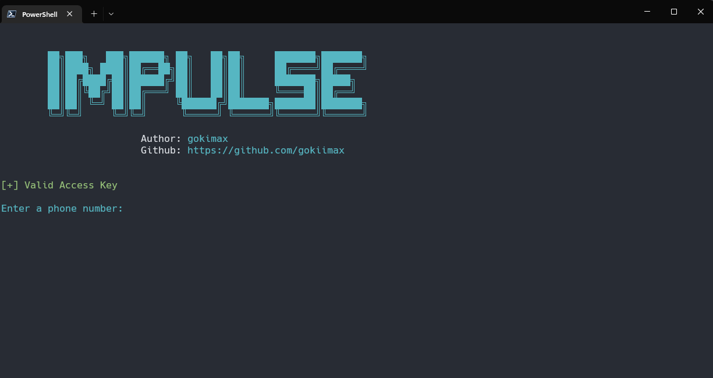

# Impulse

*Usage:*

1. Go to [https://app.numlookupapi.com](https://app.numlookupapi.com). And get your Access Key from there 🔑
2. Add you Access Key to the [`config.json`](./config.json) file 🔧
3. Install the dependencies: `python3 -m pip install -r requirements.txt` 📜
4. Launch Script: `python3 Impulse.py`

> 

⚠️ *Disclaimer:* ⚠️

>This tool is for educational purposes only. I am not responsible for any damage you cause.
